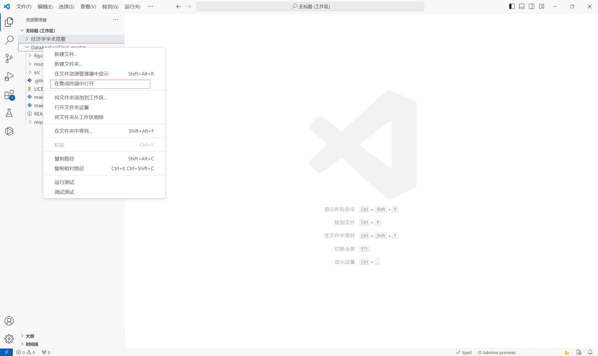
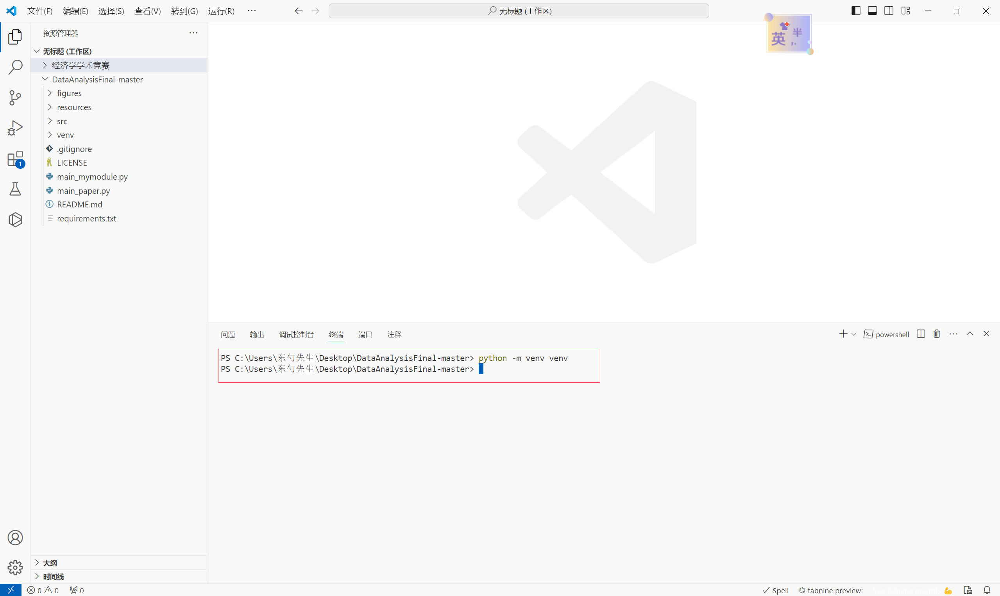
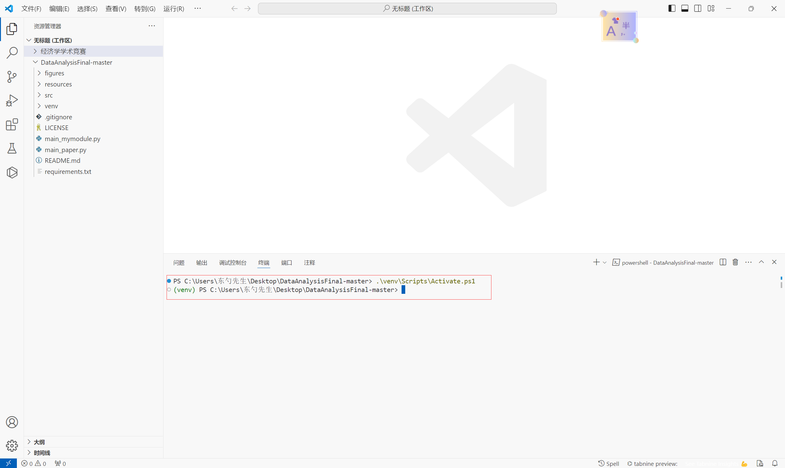
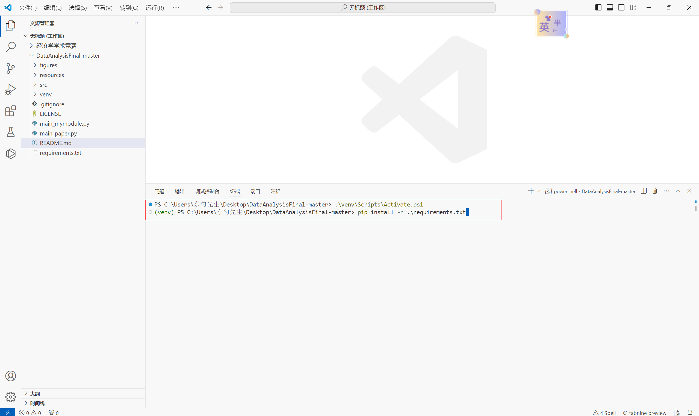
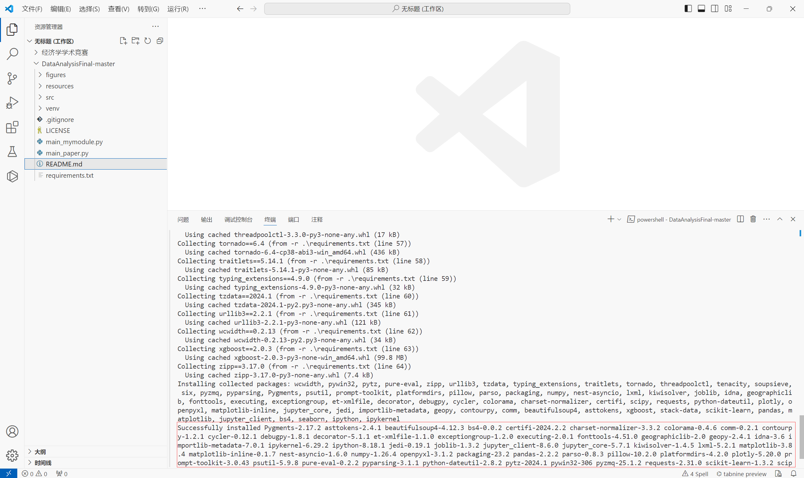

# DataAnalysisFinal
2023-2024-2学期学习数据分析的期末项目

### 一、Setup

> 非常建议使用vscode打开本项目，不过得确定你已经在vscode中配置好Python以及Jupyter notebook的环境
>
> Python版本为3.9.7

1.(如果有git的话)打开Git Bash，输入`git clone git@github.com:FantasySilence/DataAnalysisFinal.git`，获取项目源代码。

2.在vscode中打开对应文件夹，然后右键点击文件夹，选择"在集成终端中打开"。



3.在终端中输入 `python -m venv venv`创建虚拟环境。



4.创建完成后继续在终端中输入`.\venv\Scripts\Activate.ps1`激活虚拟环境，当发现终端显示的文字信息中出现"(venv)"时，激活成功。



5.激活成功后继续在终端输入` pip install -r .\requirements.txt`安装环境依赖。



6.等观察到Successfully...字样时，就可以愉快的运行啦\o/。



>在配置环境时可能会出现以下问题：
>
>1.配置环境时，可能会遇到pandas等Python库安装失败，这主要是因为我使用的Python版本是3.9.7，这些包的版本也相对较低。只需要重新下载这些包就可以了。
>
>2.创建虚拟环境时，输入`python -m venv venv`命令时可能会没有反应，这主要是因为Windows Powershell没有权限。请以管理员身份运行Windows Powershell，并输入`Set-ExecutionPolicy RemoteSigned`，一路点击确定并重启IDE即可。具体可以参考这篇[博客](https://blog.csdn.net/lsdaini/article/details/132778970)

### 二、注意事项

#### 1. 数据的获取

数据的获取使用到了爬虫，请确保网络连接正确以及及时输入验证码避免反爬虫。

#### 2. 数据解析部分

数据解析部分使用了百度地图开发者API用于将门牌地址转换为经纬度坐标以及地点检索，请自行按照百度地图开发者API中的[地理编码](https://lbsyun.baidu.com/faq/api?title=webapi/guide/webservice-geocoding)和[地点检索](https://lbsyun.baidu.com/faq/api?title=webapi/guide/webservice-placeapi)，生成应用，并修改[这里](src/common/infoTool/const.py)的ak密钥，程序中给出的密钥只是一个示例无法运行。

#### 3. 结果复现

只需要运行`main_paper.py`就可以获得全部复现的结果，运行`main_mymodule.py`即可获取我所做工作的全部结果。

> 注意：包含网格搜索的内容运行时间极长，请注意运行时间！！！

#### 4. 项目结构

本项目的项目结构如下，可以根据所需对源代码进行查阅，相关注释都十分详尽：
<<<<<<< HEAD

=======

```
DataAnalysisFinal(项目根路径)
├── figures(存放了可视化结果的图片)
├── README_img(存放了自述文件的图片)
|
├── resources(存放了相关数据集，网页源代码等)
|	  ├──datasets(存放了完成本项目所需的数据集)
|	  |	  ├──row_data(通过爬虫获取的58二手房原始数据)
|	  |	  ├──processed_data(通过爬虫获取的58二手房数据进行处理后的结果)
|	  |	  └──house-prices-advanced-regression-techniques(论文使用的数据集)
|	  |
|	  ├──models(存放了完成本项目部分训练好的模型)
|   └──webtexts(存放了爬虫获取到的网页源代码)
|
├── src(源代码)
|	  |
|	  ├──common(存放了一些工具类)
|	  |	  |
|	  |	  ├──figTool(图片工具类)
|	  |	  |	  ├──dataonmap.py(将房子所在位置绘制于地图上)
|	  |	  |	  ├──evaluateobjectbase.py(机器学习评估绘图模块的对象基类)
|	  |	  |  	└──plotobjectbase.py(其他绘图模块的对象基类)
|	  |	  |
|	  |	  ├──fileTool(文件工具类)
|	  |	  |	  ├──figuresio.py(用于图片文件存储时自动获取路径)
|	  |	  |	  └──filesio.py(用于读取或存储数据集时自动获取路径)
|	  |	  |
|	  |	  ├──infoTool(信息工具类)
|	  |	  |	  ├──const.py(一张常量表，存储经常用到的常量)
|	  |  	|	  └──randomIPandHeaders.py(随机生成代理IP以及请求头)
|	  |	  |
|	  |	  ├──locTool(位置信息工具类)
|	  |	  |	  ├──coordutils.py(将房子所在地址的经纬度坐标转换为精准的坐标)
|	  |	  |	  ├──lnglat.py(将房子所在地址转换为经纬度坐标)
|	  |	  |	  └──poiinfo.py(用于获取当前位置周边的信息)
|	  |	  |
|	  |	  └──modelTool(模型工具类)
|	  |		├──modelsio.py(用于保存训练好的模型或调用训练好的模型)
|	  |		└──split.py(用于模型训练时分离目标变量与特征)
|	  |
|	  ├──modules(存放了实现项目任务的模块)
|	  |	  |
|	  |	  ├──analysis(数据的探索性分析)
|	  │   │   ├── heatmap.py(绘制热力图)
|	  │   │   ├── relativity.py(绘制与目标变量的相关性)
|	  │   │   ├── roomswithtarget.py(房间数与目标之间的关系)
|	  │   │   ├── subwayproximity.py(距离地铁的距离)
|	  │   │   └── surroundingswithtarget.py(房子周围信息与目标的关系)
|	  |	  |
|	  |	  ├──datapreparation(数据准备与数据预处理)
|	  │   │   ├── datacrawler.py(爬虫，爬取器)
|	  │   │   ├── dataparser.py(爬虫，解析器)
|	  │   │   ├── pipeline58.py(处理从58同城爬取的数据)
|	  │   │   └── pipelinepaper.py(论文提到的数据处理流程)
|	  |	  |
|	  |	  ├──evalution(机器学习评估绘图)
|	  │   |   ├── confusion_matrix.py(绘制混淆矩阵)
|	  │   |   ├── feature_importance.py(绘制特征重要性)
|	  │   |   ├── learning_curve.py(绘制学习曲线)
|	  │   |   ├── pr_tradeoff.py(绘制pr_tradeoff曲线)
|	  │   |   ├── pr.py(绘制PR曲线)
|	  │   |   └── roc.py(绘制ROC曲线)
|	  |	  |
|	  |	  ├──visualization(数据可视化)
|   │   |   ├── geo_distribute.py(绘制房子的地理分布)
|   │   |   ├── more_feature.py(绘制房子的其他特征)
|   │   |   ├── rooms.py(绘制房间数)
|   │   |   ├── subway.py(绘制地铁临近)
|   │   |   ├── surroundings.py(绘制周边信息)
|   │   |   └── target_in_paper.py(绘制论文中目标变量的分布)
|	  |
├── test(一些测试代码)
├── venv(虚拟环境，请根据前文指引自行配置，为了减小压缩包体积这个文件夹并未附上)
├── main_mymodule.ipynb(我在论文基础上使用我的数据进行的工作(notebook版))
├── main_mymodule.py(我在论文基础上使用我的数据进行的工作)
├── main_paper.ipynb(复现论文时做的工作(notebook版))
├── main_paper.py(复现论文时做的工作)
├── requirements.txt(项目的环境依赖)
├── .gitignore
└── LICENSE
```
>>>>>>> a4890d28c91689c03f794a14683067f4794768a0

### 技术栈

Python | Jupyter notebook

### LICENSE

GPL-3.0 license
